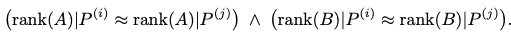

# Confirmation Phase Code Overview

The objective of this phase is to empirically calibrate the framework's decision thresholds on synthetic data and then validate the final framework's utility on real-world datasets using distinct sets of landmarking algorithms.

This phase is divided into two main parts, each with its own script:
1. Framework Calibration on Synthetic Data (`01_thresholds_calibration.Rmd`)
2. Framework Validation on Real-World Data (`02_housing.Rmd`)

## Framework Calibration on Synthetic Data

**The overall objective of the calibration phase was to identify thresholds that outperform the naive approaches in terms of their Negative Predictive Value (NPV) and Specificity.**

Main logic:
- We created a  large simulation space of 45 synthetic datasets (9 noise levels x 5 signal types).
- We chose a fixed reference dataset (noise = 0.3, signal type = 4).
- We ran a nested Monte Carlo simulation (B=50) to compare the reference dataset against all 45 test datasets, and established a "ground truth" of which datasets are truly similar via a binomial proportion test.
- The results were used to visually and quantitatively evaluate candidate thresholds.

The analysis suggests that Δn = 0.2 and Δs = 0.15 are a sensible choice for the framework's thresholds, representing **one of several possible** solutions that provide a strong balance of NPV and Specificity and outperform both conservative and liberal baselines.

### Script overview

The threshold calibration script follows the following structure:
1. Global parameters
2. Helper functions
    1. Generate data and visualize
    2. Train-Test algorithms
    3. Rank correlation
    4. Sanity check using 1 reference and 1 non-reference dataset
3. Main simulation loop over B Monte Carlo iterations
4. Binomial proportion test
5. Visualize Noise-LM plot
6. Threshold Calibration
7. Naive approaches
8. Appendix - Advanced decision rule

We provided additional comments within each `.Rmd` file for the following functions and code sections:
1. Global parameters -> Includes noise and signal decision boundary. This is where the high level tuning happens.
2. `generate_data`
3. `generate_summary_table` -> Train-test algorithms
4. `get_rank_cor` -> Compute rank correlation
5. Main simulation loop
6. `get_LM_noise_corners` -> Defines the decision boundary
7. `get_precision` -> Computes the Negative Predictive Value (NPV) based on the decision boundary
8. `get_coverage` -> Computes the Specificity based on the decision boundary

## Confirmation on real-life data

**This script validates the framework and the calibrated thresholds by applying them to five real-world datasets. Moreover, it breaks the "paradoxical setup" by using two distinct (but comparable) sets of landmarking algorithms for the reference and non-reference datasets.**

We loaded 5 datasets:
1. Boston housing
2. Ames housing
3. California housing
4. Insurance
5. Longely

Landmarking set A:
1. Elastic net
2. Random forest
3. Linear regression 
4. XGBoost
5. SVM

Landmarking set B:
1. **GAM**
2. Random forest
3. Linear regression 
4. XGBoost
5. SVM

So the only difference between landmarking sets A and B is that Elastic Net was replaced by a GAM.

The validation procedure was as follows:
1. The Boston Housing dataset was set as the reference.
2. The framework's predictions were generated by using Set A on the reference and Set B on the non-reference datasets.
3. The procedure was inverted (Set B on reference, Set A on non-reference) to ensure robustness.
4. Both sets of predictions were compared against the ground-truth rank correlations to confirm that the success condition was met.

The framework made correct predictions in all test cases, regardless of which landmarking set was used for the reference. Therefore, it meets the success condition defined at the beginning of the thesis:

