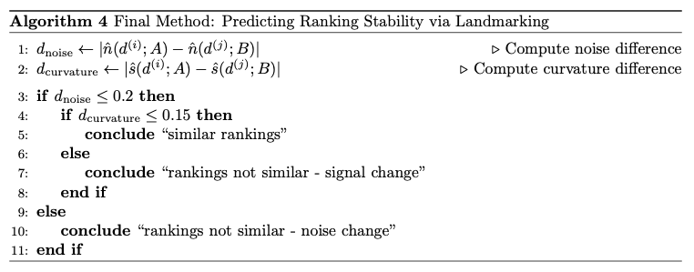

# Leiden Master Thesis R Code

## Thesis Overview

**The goal of this thesis was to address the algorithm selection problem (ASP) for supervised machine learning (regression with numerical covariates only) via a problem space similarity assessment.**

A popular strategy to address the ASP is meta-learning, where a machine learning algorithm (the meta-learner) predicts how other machine learning algorithms will perform based on historic algorithm performance values, given a wide selection of datasets. We believe that three issues exist with the current meta-learning approaches, namely computational overhead, lack of interpretability, and sensitivity to the initial dataset collection. 

To address these issues, we propose a paradigm shift from predicting algorithm performance to assessing problem space similarity. To this end, we developed and empirically evaluated a computationally inexpensive and highly interpretable framework. It allows practitioners to assess problem space similarity between two datasets by quantifying a dataset’s noise and signal characteristics and combining them in a simple, threshold-based decision rule. Unlike traditional meta-learning approaches that require predetermined algorithm and dataset collections, our framework enables practitioners to characterize datasets, potentially allowing for a broader consideration of algorithms from the literature.

## Repository Overview

The repository mirrors the methodoly subsections of
1. Exploration
2. Confirmation
3. Edge Cases

Each folder (`01_exploration`, `02_confirmation`, `03_edge_cases`) contains:
- **`.Rmd` file:** The main R Markdown script with all the code for the experiment.
- **`.Rdata` files:** Saved R data objects containing the results of the simulations, allowing for quick reproduction of plots.
- **`.png` files:** The plots and figures as they appear in the thesis.

In the exploration phase we worked under the hypothesis that algorithm rankings serve as a proxy for the problem space complexity of a single dataset, and investigated the key drivers that result rank instability. Our results suggest that noise and signal type changes were the main drivers.

In the confirmation phase we formalized and developed our framework using synthetic datasets and then on real-life data. Our framework uses landmarking to estimate the noise and signal level of the underlying dataset. Then, it employs a sequential, thresholds-based logic to implement the problem space similarity assessment.



In the edge case analysis we investigated under which conditions our proposed framework fails.

The R version used for this master's thesis was: 4.4.1 (2024-06-14)

## How to run files

To reproduce an experiment:
1.  Navigate to the relevant sub-folder (e.g. `./01_exploration/01_Data_shift_signal_type/`).
2.  Open the `.Rmd` file (e.g. `01_signal_type_change.Rmd`) in RStudio.
3.  Run all the code chunks to execute the simulation and generate the plots and summary tables.

Make sure to install the following packages:
```
install.packages(c(
  "MASS", "AmesHousing", "qacr", "dplyr", "tidyr", "tibble", "stringr",
  "glmnet", "randomForest", "xgboost", "e1071", "mgcv",
  "ggplot2", "scales", "ggrepel", "progress"
))
```

**Note:** The simulations can take a significant amount of time. Pre-computed results from the thesis are saved as `.Rdata` files in each folder. You can load these files to explore the visualizations without re-running the simulations. To do so, you need to run all chunks **except** for the `main simulation loop`. 
